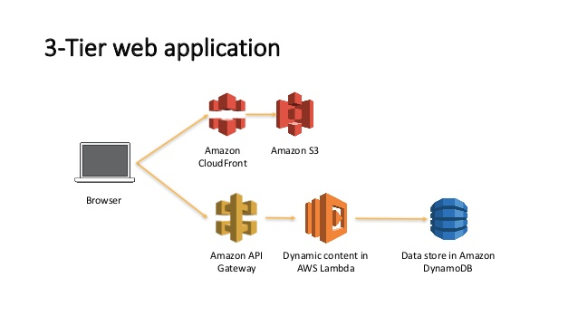

# OpenATS

### _High volume applicant tracking system_

[Website](https://openats.app)

[Roadmap](https://trello.com/b/iBMcfzJS/openats-kanban)

OpenATS is an attempt to create a modern, ⚡ serverless ⚡, event driven implementation of your typical applicant tracking system.

FYI: I will be using the term 'funnel' instead of 'job'. The reason for this is that a 'job' does not have to be a solid title like '_Engineer_'. It could instead refer to a city in which a food delivery company might operate in and 'job' doesn't fit this use case.

> - We need more drivers in the Boston funnel for this week ✅
> - Let's send an email to everyone in the Miami 'Questionnaire' funnel ✅
> - The NYC funnel is pretty backed up, we should get more specialists working that ticket queue ✅
> - We cleared out the final review job and were able to get more drivers on the road! ❌

Overall, the premise is simple:

- There are funnels
- These funnels have stages _(Questionnaire, Interview, Hired, Rejected, etc.)_
- Applicants move through stages

#### Tech

A React frontend hosted on S3 + Cloudfront and a NodeJS backend running on AWS Lambda with the [Serverless framework](https://www.serverless.com/). As of 2021-05-02, I have not decided on a search engine, but I am leaning towards [MeiliSearch](meilisearch.com). Ideally, a Lambda can pick up the DynamoDB streams and send it over to the EC2 instance running Meili. Elastic just seems too expensive :/
At the very basic level, this is what we are trying to build:

I tried to follow [Alex DeBrie's best practices](https://www.youtube.com/watch?v=DIQVJqiSUkE) because after all, he **literally** [wrote the book](https://www.dynamodbbook.com/) on it. Also, huge shoutout to Rick Houlihan and [his talk](https://www.youtube.com/watch?v=HaEPXoXVf2k&).

The DynamoDB access patterns are as follows:

**Primary Index - OpenATS**

- Get an applicant by an ID
- Get funnel info by ID (_Description, salary, location, etc._)
- Get a funnel's stages by ID
  - SK: 'begins_with' = 'STAGE#'

**GSI: ApplicantsByFunnelByStage**

- Get all applicants in a funnel
- Get all applicants in a funnel in a specific stage
- Get all applicants in a funnel in a specific stage... that are over 21! And have their own car!
  - Just do a filter expression here

**GSI: AllByType**

- Get all records of a certain type

  - SK: 'begins_with' = 'YOUR_TYPE#'

  Essentially a mini scan but has some small use cases. Also allows us to do basic name search as well via the SK generic name we made. I chose to leave it lowercase across the board to deal with names that have a capital in the middle like DeBrie

**GSI: AllApplicantsInASpecificStage**

- Get all applicants across all funnels in a specific stage
  - SK is an ISO 8601 timestamp of their creation date. Set >= beginning of time to get all records lol
